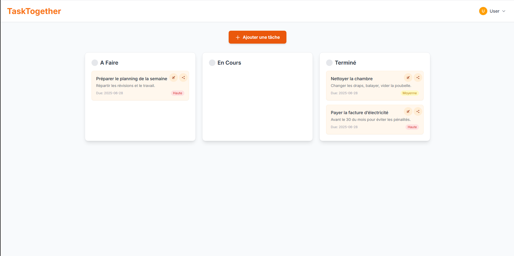
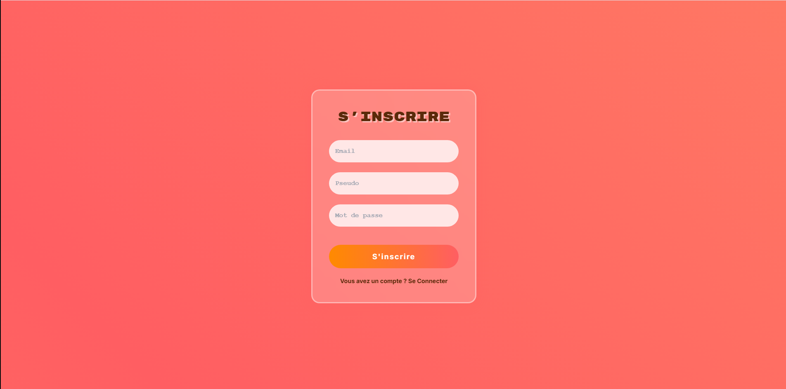

 <h1>TaskTogether</h1>

  

    <strong>TaskTogether</strong> est une application web collaborative de gestion de tâches en temps réel, conçue pour les étudiants et les équipes souhaitant organiser efficacement leur travail. Elle propose une interface moderne, intuitive et responsive, avec une synchronisation en temps réel via Firebase.
  

  <h2>Fonctionnalités</h2>
  <ul>
    <li>Authentification sécurisée (inscription et connexion via Firebase Auth)</li>
    <li>Ajout, modification et suppression de tâches</li>
    <li>Synchronisation en temps réel grâce à Firestore</li>
    <li>Interface moderne avec effets visuels (glassmorphism, dégradés)</li>
    <li>Réorganisation des tâches par glisser-déposer</li>
  </ul>

  <h2>Technologies utilisées</h2>
  <ul>
    <li><strong>Frontend :</strong> React.js, Tailwind CSS</li>
    <li><strong>Backend / Base de données :</strong> Firebase (Auth, Firestore, Hosting)</li>
    <li><strong>Icônes :</strong> Heroicons</li>
  </ul>

  <h2>Installation locale</h2>

  <h3>1. Cloner le dépôt</h3>
  <pre><code>git clone https://github.com/mxrtixn/TaskTogether.git
cd TaskTogether</code></pre>

  <h3>2. Installer les dépendances</h3>
  <pre><code>npm install</code></pre>

  <h3>3. Configuration de Firebase</h3>
  <ul>
    <li>Créer un projet sur <a href="https://console.firebase.google.com/">Firebase Console</a></li>
    <li>Activer l’authentification par email/mot de passe</li>
    <li>Créer une base de données Firestore</li>
    <li>Récupérer les informations de configuration dans les paramètres du projet</li>
    <li>Ajouter ces informations dans le fichier <code>firebase-config.js</code></li>
  </ul>

  <h3>4. Lancer l’application</h3>
  <pre><code>npm run dev</code></pre>
  
L'application sera accessible sur <code>http://localhost:5173</code>.

</code></pre>

  <h2>Captures d’écran</h2>
  
Voici quelques aperçus de l’interface de l’application :

  
    
  

  <h2>Améliorations prévues</h2>
  <ul>
    <li>Ajout de pièces jointes aux tâches</li>
    <li>Intégration d’un système de notifications</li>
    <li>Affichage calendrier</li>
    <li>Gestion avancée des équipes</li>
  </ul>

  

  

    Réalisé par 
    <a href="https://www.linkedin.com/in/rida-elantari-11a93a315/" target="_blank">Rida ELANTARI</a> &nbsp;|&nbsp;
    <a href="https://www.linkedin.com/in/hamza-el-manouzi-a42a9a34a/" target="_blank">Hamza EL MANOUZI</a>
  

